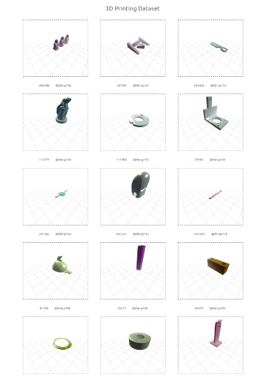

3dprintingdataset: A 3d model dataset with gcodes based on the [thingy10k](https://ten-thousand-models.appspot.com) dataset.
=================================================

Access the app for comfortably viewing the dataset via [https://bbrosint.github.io/3dprintingdataset](https://bbrosint.github.io/3dprintingdataset)



Table of contents
-----------------

- [3dprintingdataset: A 3d model dataset with gcodes](#3dprintingdataset)
  - [Table of contents](#table-of-contents)
  - [Introduction](#introduction)
  - [Downloading the dataset](#download)
    - [Preliminary steps](#preliminary-steps)
    - [Download script](#download-repo)
    - [Operation](#operation)
  - [License](#license)
  - [Authors](#authors)
  - [Acknowledgments](#acknowledgments)


Introduction
------------

The main branch of this repository consists of a `python 3` script for downloading the dataset.

The downloading script's dependencies are:

* [tqdm](https://github.com/tqdm/tqdm)
* [requests](https://requests.readthedocs.io/)


Downloading the dataset
------------

### Preliminary steps
Before downloading, make sure to have at least `250 GB` of free disk space available! Make sure to have a recent version of `python 3` installed.

### Download script
If you have git installed, simply clone this repository by

```bash
git clone https://github.com/bbrosint/3dprintingdataset.git
```

If you do not have git installed, simply [download](https://github.com/bbrosint/3dprintingdataset/archive/refs/heads/main.zip) the repository as `.zip` archive from github and extract the files locally.

Install the dependencies via 

```bash
pip install -r requirements.txt
```

### Operation
Open a shell and execute the script with the `python` interpreter:

```bash
python download_dataset.py
```

This will download all available files. To restrict the download to certain files, use the console arguments:

```bash
python download_dataset.py -s s,l -f gcode
```

This will only download `gcodes`of small and large sized 3d models.


License
-------

The contents of this repository are MIT licensed. This applies ONLY for the files in this repository. The individual 3d model files have their own license. These 3d model files may have been altered for this dataset. The provision of these 3d model files is only for academic purposes. Before reusing any of the 3d models, please refer to their original license.


Authors
-------

If you use this 3d dataset in your work, please cite this paper:

```BibTex
@article{semi_automated_2023,
	title = {Semi-automated method for reviewing 3d printing datasets},
	volume = {3},
	doi = {10.15488/14297},
	urldate = {2023-08-08},
	journal = {Journal of Production Systems and Logistics},
	author = {Brede, S. and Küster, B. and Overmeyer, L.},
	collaborator = {Technische Informationsbibliothek (TIB)},
	month = jul,
	year = {2023},
	note = {Publisher: Hannover : publish-Ing.},
	pages = {1--10},
}

```

Acknowledgements
----------------

The original 3d model files were collected by `Zhou` and `Jacobson` and published as the [thingy10k](https://ten-thousand-models.appspot.com) dataset.

[Blender3d](https://blender.org) was used for reviewing the original dataset.

[Slic3r](https://slic3r.org/) and [printrun](https://github.com/kliment/Printrun) (gcoder) were used for generating the `G-Codes`.

The app for viewing the dataset was developed with the [Vue3](https://vuejs.org) framework with the help of [ThreeJS](https://threejs.org).
